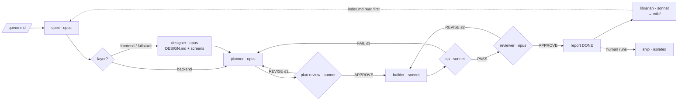

# Vidhana

**Vidhana** (Sanskrit *vidhāna*: arrangement, procedure) is an unattended software-engineering pipeline for [Claude Code](https://docs.claude.com/en/docs/claude-code/overview). Drop a feature or bug into a queue; a team of nine pinned-model subagents writes the spec, designs the screens when the item touches UI, plans it, reviews the plan, builds it test-first on a branch, runs QA, reviews the diff, writes a report, and files what it learned into a project wiki. Shipping is a separate command a human runs.

Built on two open-source skill libraries — [gstack](https://github.com/garrytan/gstack) (spec, design system, plan review, QA, review, ship) and [Superpowers](https://github.com/obra/superpowers) (writing and executing plans) — and on [Karpathy's LLM Wiki pattern](https://gist.github.com/karpathy/442a6bf555914893e9891c11519de94f) for memory.

## Status, honestly

| What | Evidence |
|---|---|
| Every referenced skill exists in the upstream repos (Sept 2026) | [verification report](docs/verification-report.md) rows 1–5 |
| No-human mode is real: gstack's own `GSTACK_SESSION_KIND=spawned` auto-chooses at every prompt | row 3 |
| The safety gate blocks an agent that hasn't written its artifact or verdict | `bash tests/gate-selftest.sh` → 17/17 |
| The wiki lint catches broken links, orphans, un-indexed pages, copied values, bad log lines | `bash tests/wiki-lint.sh` + 6 planted defects, rows 17–18 |
| **The full end-to-end run on a real repo** | **not proven here** — needs your credentials; [test guide](docs/test-guide.md) L1–L5 and W1–W7, ~half a day |

There is no controlled evidence that this produces better code than one careful session. What it provably gives you is hard fences (no push, no merge, no finishing without an artifact), a paper trail per feature, and a wiki that stops the next feature from re-reading the whole repo.

## Quick start

```bash
# 1. put the kit in your project (works for an empty repo too — run git init first)
git clone --depth 1 https://github.com/DDharma/vidhana.git tmp-kit && rm -rf tmp-kit/.git && cp -r tmp-kit/. . && rm -rf tmp-kit

# 2. install the two skill libraries (once per machine) and check the kit
bash scripts/bootstrap.sh
bash tests/gate-selftest.sh      # vidhana gate-selftest: 17 passed, 0 failed
bash tests/wiki-lint.sh          # vidhana wiki-lint: clean

# 3. trust the folder once, then tell it about your project
claude                           # accept the trust dialog, then /exit
$EDITOR CLAUDE.md                # four lines: NAME, STACK, RULES, DESIGN (Figma URL or none)

# 4. queue an item and run
$EDITOR pipeline/queue.md
claude --agent orchestrator

# 5. read the report, then ship by hand
cat pipeline/reports/<id>.md
claude --agent ship "ship item <id>"
```

Full walkthrough: [docs/getting-started.md](docs/getting-started.md).

## How it works



Full diagram with gates and the enforcement layer: [docs/pipeline-diagram.md](docs/pipeline-diagram.md).

Four mechanisms make it unattended: gstack's spawned mode (skills never ask), round caps in `CLAUDE.md` (three plan rounds, three QA rounds, two review rounds, then `BLOCKED`), a `SubagentStop` hook that refuses to let an agent finish without its artifact, and a permission deny list that refuses `git push`, `git merge`, `rm -rf`, and edits to `.claude/` or the queue at the harness level.

## Repository layout

```
CLAUDE.md                 4 editable lines + the pipeline contract + design and wiki schemas
DESIGN.md                 project design system — created by the designer on the first UI item (not shipped)
.claude/
  settings.json           env, allow/deny, hooks (SessionStart bootstrap, SubagentStop gate, Stop sync)
  agents/                 orchestrator spec designer planner plan-reviewer builder qa reviewer librarian ship
  hooks/                  gate.sh · sync-reports.sh
  rules/                  wiki-conventions.md
pipeline/                 queue.md · state.json · specs/ designs/ plans/ reviews/ qa/ reports/   (raw sources)
wiki/                     index.md · log.md · overview.md · gotchas.md · modules/ decisions/ items/
scripts/bootstrap.sh      installs gstack + Superpowers; idempotent; used by cloud sessions
tests/                    gate-selftest.sh · wiki-lint.sh
docs/                     see below
.github/workflows/        pipeline.yml — CI template, read before enabling
```

## Documentation

| Read this | If you want to |
|---|---|
| [getting-started.md](docs/getting-started.md) | install it and run your first item |
| [build-guide.md](docs/build-guide.md) | understand every file, the model choices, and how to run it in the cloud (§9) |
| [test-guide.md](docs/test-guide.md) | prove it on your machine before trusting it |
| [verification-report.md](docs/verification-report.md) | see what is proven, how, and what isn't |
| [wiki-structure.md](docs/wiki-structure.md) · [wiki-usage.md](docs/wiki-usage.md) | understand and tune the project-memory layer |
| [pipeline-diagram.md](docs/pipeline-diagram.md) | see the whole flow |

## Requirements

Claude Code ≥ 2.1.33 · git · `jq` or `python3` · your project's toolchain · a Claude subscription or API key. Optional: a Figma MCP server named `figma`, if `DESIGN:` points at Figma. Cost is real: 6–10 Claude sessions per queue item (one more for UI items) plus one for the librarian. Measure on a small fixture first ([test guide L4](docs/test-guide.md)).

## Contributing to Vidhana

Run both test scripts before opening a PR. Changes to gate behaviour need a new self-test case; changes to wiki rules need a lint case. If you disprove a claim in the verification report, please open an issue with the command that shows it.

## Credits and license

MIT — see [LICENSE](LICENSE). gstack and Superpowers are separate projects under their own licenses and are installed, not bundled. The wiki layer implements the pattern from Andrej Karpathy's LLM Wiki gist.
